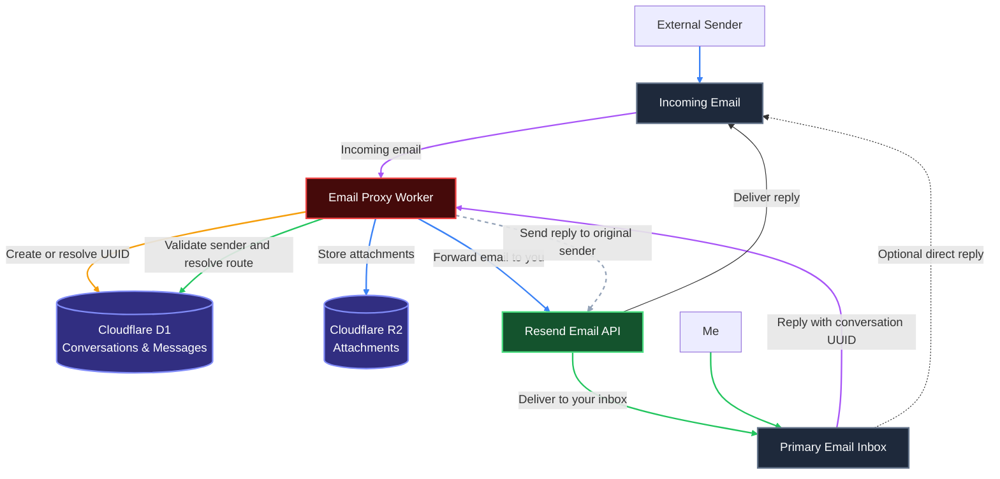

# Resend email proxy

This is a proxy to allow me to us both my old and new email addresses, as my current inbox doesn't support multiple API keys or webhooks.

## My plan

```mermaid
flowchart TD
    Sender["Incoming Email"]
    Worker["Email Proxy Worker"]
    D1[("Cloudflare D1<br/>Conversations & Messages")]
    R2[("Cloudflare R2<br/>Attachments")]
    Resend["Resend Email API"]
    Inbox["Primary Email Inbox"]
    PersonA["External Sender"]
    PersonB["Me"]

    PersonA --> Sender
    Sender -->|Incoming email| Worker
    Worker -->|Create or resolve UUID| D1
    Worker -->|Store attachments| R2
    Worker -->|Forward email to you| Resend
    Resend -->|Deliver to your inbox| Inbox

    Inbox -->|Reply with conversation UUID| Worker
    PersonB --> Inbox
    Worker -->|Validate sender and resolve route| D1
    Worker -->|Send reply to original sender| Resend
    Resend -->|Deliver reply| Sender

    Inbox -.->|Optional direct reply| Sender

    linkStyle 0 stroke:#3b82f6,stroke-width:2px
    linkStyle 1 stroke:#a855f7,stroke-width:2px
    linkStyle 2 stroke:#f59e0b,stroke-width:2px
    linkStyle 3 stroke:#3b82f6,stroke-width:2px
    linkStyle 4 stroke:#3b82f6,stroke-width:2px
    linkStyle 5 stroke:#22c55e,stroke-width:2px
    linkStyle 6 stroke:#a855f7,stroke-width:2px
    linkStyle 7 stroke:#22c55e,stroke-width:2px
    linkStyle 8 stroke:#22c55e,stroke-width:2px
    linkStyle 9 stroke:#94a3b8,stroke-width:2px,stroke-dasharray:5 5

    classDef external fill:#1e293b,stroke:#64748b,color:#f8fafc,stroke-width:2px
    classDef worker fill:#450a0a,stroke:#ef4444,color:#fff,stroke-width:2px
    classDef storage fill:#312e81,stroke:#818cf8,color:#fff,stroke-width:2px
    classDef service fill:#14532d,stroke:#4ade80,color:#fff,stroke-width:2px

    class Sender,Inbox external
    class Worker worker
    class D1,R2 storage
    class Resend service

```